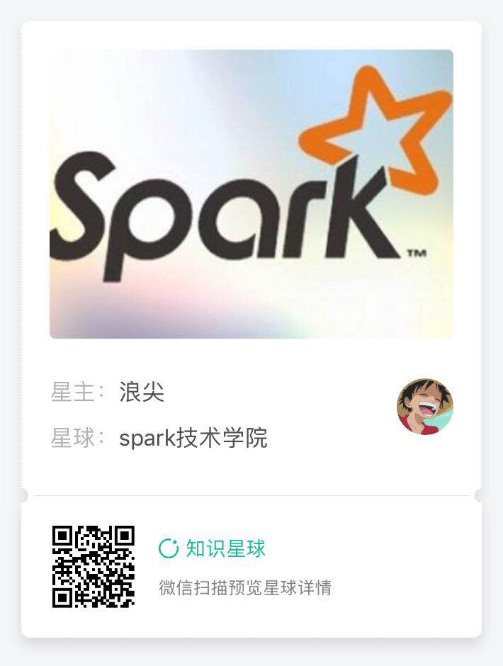

浪尖带着你阅读spark源码

### Spark Core源码阅读
1. [Spark Context 阅读要点](core/SparkContextsReadPoints.md)

2. [Spark的缓存，变量，shuffle数据等清理及机制](core/AboutContextCleaner.md)

3. [Spark-submit关于参数及部署模式的部分解析](core/AboutSparkSubmit.md)

4. [GroupByKey VS ReduceByKey](core/ReduceByKeyAndGroupByKey.md)

### Spark Sql源码阅读

1. [Spark Sql源码阅读](sql/README.md)

### Spark Streaming源码阅读

1. [动态发现新增分区](streaming/DiscoverNewPartition.md)

2. [Dstream join 操作和 RDD join 操作的区别](streaming/DStreamJoinVSRddJoin.md)

3. [PIDController源码赏析及 back pressure 实现思路](./core/PIDController.md)

4. [Streaming Context重点摘要](streaming/AboutStreamContext.md)

更多大数据文章请关注浪尖微信公众号：Spark学习技巧

浪尖和阿里大神一起创建了知识星球-spark技术学院，欢迎大家扫码加入：

